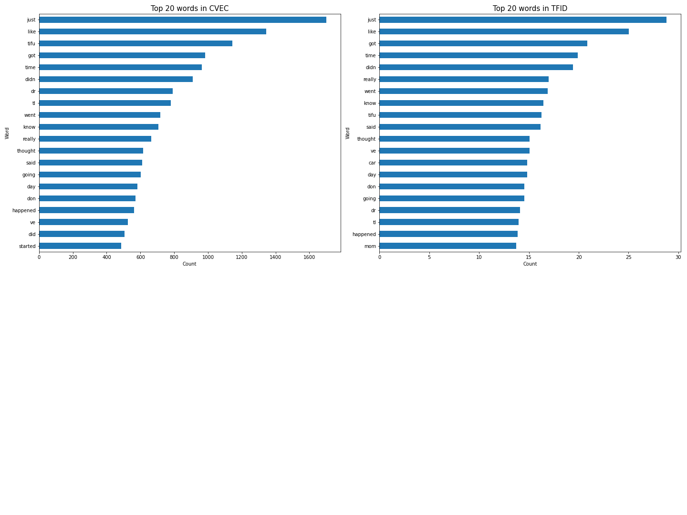
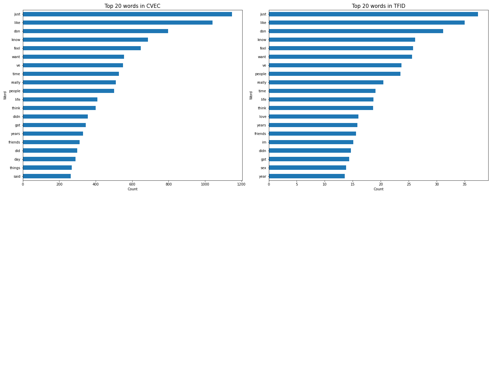
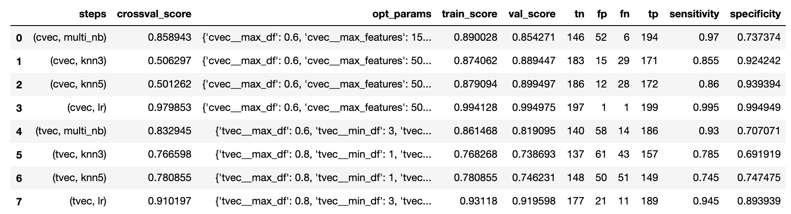
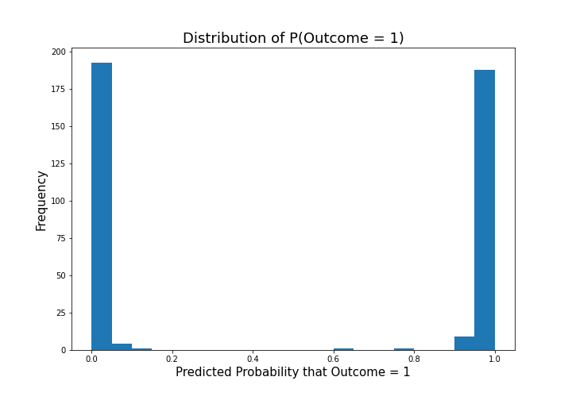
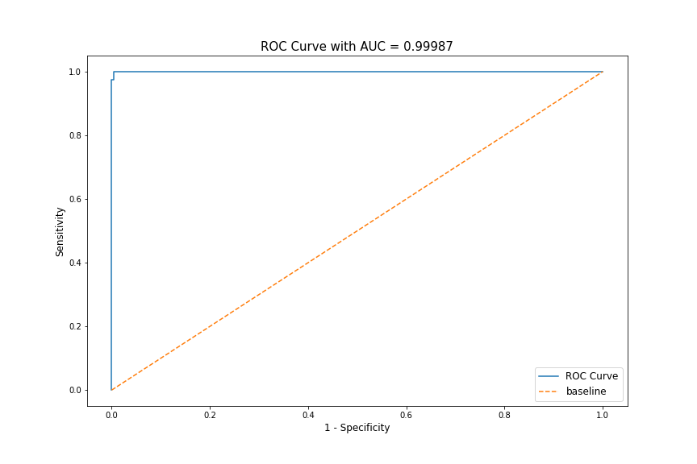

# Natural Language Processing: Classification of Subreddits
---

## Preamble
This project aims at developing a machine learning model using Natural Language Processing for classifying text into two different subreddits.

---

## Contents
* [1. Problem Statement](#chapter1)
    * [1.1 Context & Motivation](#chapter1_1)
    * [1.2 Stakeholders](#chapter1_2)
    * [1.3 Problem Statement](#chapter1_3)
* [2. Data Dictionary](#chapter2)
    * [2.1 Original Ames Housing Data](#chapter2_1)
    * [2.2 Additional Parameters](#chapter2_2)
* [3. Executive Summary](#chapter3)
    * [3.1 Context & Initial Assumptions](#chapter3_1)
    * [3.2 Data Science Process](#chapter3_2)
    * [3.3 Key Findings](#chapter3_3)
* [4. Recommendations & Conclusion](#chapter4)
    * [4.1 Addressing Problem Statement](#chapter4_1)
    * [4.2 Findings and Takeaways](#chapter4_2)
    * [4.3 Further Opportunities](#chapter4_3)
    
## 1. Problem Statement 

### 1.1 Context & Motivation 
Natural Language Processing can be used to classify strings of text into different categories. However, if the strings of texts are very similarly written, would the model still be able to generalize well?

For the purpose of this exploration, two subreddits from the same category of 'Stories' will be explored. These two subreddits both contain personal stories and experiences of varying topics, written in a very similar fashion. Furthermore, there is high overlap in terms of the content as there is no specific topic separating the two.

The two subreddits that will be explored are:
- [tifu](https://www.reddit.com/r/tifu/)
- [confessions](https://www.reddit.com/r/confessions/)

### 1.2 Stakeholders 
|Stakeholders|Value Proposition|Problem Type|
|:--|:--|:--|
|Data Science Community|- How do different models fare in text classification - Insights on what factors contribute to improving score - Is NLP successful in categorizing texts where content is largely similar?|Data Science|

### 1.3 Problem Statement 
For strings of texts that are largely similar in content due to belonging to the same category and style of writing, is NLP successful in creating a model that categorizes the data well?

A success indicator would be a model that achieves a higher accuracy than the baseline. As the number of posts being extracted is controlled, the data will have relatively balanced classes and accuracy will be used as the success metric. 

## 2. Data Dictionary 

### 2.1 Subreddit Data Extracted 
- tifu_subreddit.csv
- confessions_subreddit.csv
- clean_data.csv

Feature|Data Type|Data Description|
|:--|:--|:--|
|`name`|string|Masked user_id of poster|
|`title`|string|Title of the post|
|`selftext`|string|Body of the post|
|`ups`|int|Number of upvotes for the post at the time of API pull|
|`num_comments`|int|Number of comments for the post at the time of API pull|
|`subreddit`|string|Subreddit the post belongs to|

### 2.2 Modified Data 
- processed_text.csv
- train.csv
- test.csv

|Feature|Data Type|Data Description|
|:--|:--|:--|
|`text_raw`|string|Combined string of title and post|
|`is_tifu`|int|Indicator of target, 1 for is /r/tifu and 0 for is /r/confessions|
|`text_token`|list of string|Tokenized text useing Regex|
|`text_base`|string|`text_token` represented as string|
|`text_lem`|string|Lemmatized text of `text_base`|
|`text_stem`|string|Stemmed text of `text_base`|

## 3. Executive Summary 

### 3.1 Context & Initial Assumptions 
Given that these two subreddits are very story centric and written in a very similar manner, the hypothesis is that the model will not perform very well on unseen data. This is because stories are general and do not have to relate to any certain topic, and are likely just written as humour.

### 3.2 Data Science Process 
Given that this is a classification problem, classification models will be evaluated and used for prediction.

1. [Data Extraction](./code/01_api_and_data_extraction.ipynb)
 - Initial Data Exploration
 - Data Scraping
2. [Data Cleaning and EDA](./code/02_data_cleaning_eda.ipynb)
 - Data Cleaning
 - Text Processing
 - Text Feature Extraction
3. [Model Selection](./code/03_model_selection.ipynb)
 - Establishing Baseline
 - Data Preparation
 - Model Selection
4. [Model Evaluation](./code/04_model_evaluation.ipynb)
 - Run Selected Model on Test Data
 - Evaluation Metrics on Test Data
 - Evaluating Effecting of Stemming/Lemmatization
 - Evaluation and Conclusion

### 3.3 Key Findings 

#### 3.3.1 Data Extraction
Through the API, 997 posts from `/r/tifu` and 992 posts from `/r/confessions` were successfully extracted. Data extracted included:
- name
- title
- selftext
- ups
- num_comments
- subreddit

#### 3.3.2 Data Cleaning and EDA
- There were no duplicate posts that were extracted. 
- EDA revealed that posts in `/r/tifu` are typically significantly longer than those in `/r/confessions`.
- 3 posts from `/r/confessions` also only had emoticons in their title and their body, and were removed as data points
- Stemming had a higher impact and changed more words than lemmatization
- Top 20 words from `/r/tifu`

- Top 20 words from `/r/confessions`

#### 3.3.3 Model Selection

Pipeline with `CountVectorizer` and `LogisticRegression` proved to be the best performing model.

#### 3.3.4 Model Evaluation
- Pipeline achieved a accuracy score of 0.9947, significantly higher than the baseline and corectly predicting 396/397 unseen data
- Lemmatizing or Stemming did not seem to have impact on the score
- Probability distribution indicated very strong probabilities of 0 and 1, equally distributed

- ROC AUC curve had almost maximum area under the curve achieved

## 4. Recommendations & Conclusion 

### 4.1 Addressing Problem Statement 
- Despite belonging to the same category with a big overlap in top 20 words, model performed significantly above expectations
- This is attributed to a certain structure with posts from the `/r/tifu` subreddit, which included words such as `tifu` and `tl;dr`
- Findings are that if posts belonging to one of the classes have a similar structure with constant keywords, NLP is able to leverage on that in creating a model that generalizes well

### 4.2 Findings and Takeaways 
Given that the posts from the subreddits `/r/tifu` and `/r/confessions` are story centric, the hypothesis was that the model would have difficulty in classifying unseen data. 

However, the pipeline consisting of `CountVectorizer` and `LogisticRegression` performed above expectations and predicted almost all the unseen data correctly. 

Furthermore, it seemed that in story centric posts with a lot more words in any given post compared to other subreddits, text processing tools like `PortStemmer` and `Lemmatization` seemed to have little to no impact on the performance of the model.

This is possibly attributed to the posts from of the subreddits having a certain structure with fixed words such as `tifu` and `tl;dr`. Also, it was discovered in [data cleaning and EDA notebook](./02_data_cleaning_eda.ipynb) that the length of the text in the body of the posts of `/r/tifu` is a lot longer compared to `/r/confessions`, contributing to the success of `CountVectorizer`, which results in biasing words that appear more frequently.

Applications of this model could be used towards classifying documents with substantial amount of words that appear within the same category but have structures that cause certain words to appear in one class more than the other. For example, classifying text as letters or messages (assuming that greeting words such as 'yours sincerely' and 'regards' will appear in letters compared to messages).

### 4.3 Further Opportunities 
Given that certain keywords identified helped the model perform well, it could be further explored how the removal of these words would impact the effectiveness of the model, giving rise to further applications in classifying text belonging to similar categories.

While the pipeline of `CountVectorizer` and `LogisticRegression` worked well, other classification models such as `RandomForests` and `SupportVectorMachines` could be explored to evaluate their effectiveness as well.